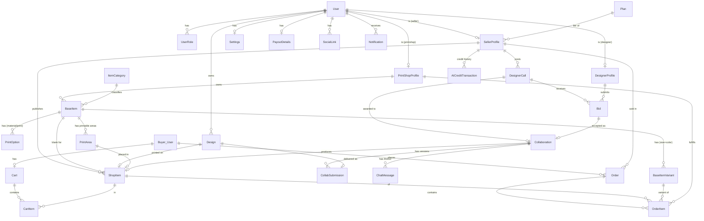

# MyHappinessClub — Data Model (v2, re-modelled)

**Created:** 2026-07-02 (step 2 — DB re-model)
**Supersedes:** `directions/MyHappinesClub-3.drawio` (the original ER diagram)
**Scope source:** [MVP-SCOPE.md](MVP-SCOPE.md) · **Language:** [CONTEXT.md](CONTEXT.md)

ORM-agnostic on purpose — this feeds the Python rebuild (step 3), so it names
entities/fields/relationships, not a specific ORM's syntax. `🔌` marks a **seam**
(field/table stored now, real integration later). `⏭️` marks a **deferred** field
(reserved column, not used in MVP).

---

## What changed from the old diagram (and why)

| Change | Why |
|---|---|
| **Added Cart / Order / OrderItem** | Old diagram had no ordering at all — but the whole PrintShop + commission flow depends on a paid Order. |
| **Added fulfillment state on OrderItem → PrintShop production queue** | PrintShop is a role that reacts to paid orders; needs an explicit `paid → in_production → handed_to_shipment` lifecycle. |
| **Role split into `UserRole` join + per-role profile tables** | Multi-role accounts (User↔Role is M:N). Each role has distinct data (storefront vs portfolio vs catalog), so profiles are separate tables, not columns on User. |
| **`Bid` added; `DesignerCall` keeps seller-set payment type** | Hiring is a bidding model: seller sets terms, designers bid a price. |
| **`Collaboration` + `CollabSubmission` + `ChatMessage`** | Makes the preview→final state machine and feedback explicit instead of loose status fields. |
| **Dropped `FollowersPercentage`, `TokenRatio` follower logic; `only_followers` kept as ⏭️** | Commission is **plan-based**; follower verification is a deferred OAuth seam. |
| **Dropped the Cargo cluster** (PickupOption/DropOptions/Cities/DeliveryTime) | Deferred — fulfillment ends at `handed_to_shipment`; cargo is a seam. |
| **AI usage → `aiCreditsBalance` + optional ledger** | AI generation is stubbed; we still track the credit concept. |

---

## ER diagram (core)

> `Buyer_User` in the diagram is just a `User` acting as a buyer (no separate
> table — everyone is a buyer by default).

---

## Tables

### Identity & roles

**User**
| Field | Type | Notes |
|---|---|---|
| id | uuid/cuid (PK) | |
| email | string, unique | |
| passwordHash | string | 🔌 or swapped for an auth provider later |
| displayName | string | |
| avatarUrl | string? | 🔌 file storage |
| createdAt | datetime | |

**UserRole** — M:N of users to roles
| Field | Type | Notes |
|---|---|---|
| id | PK | |
| userId | FK→User | |
| role | enum `BUYER \| SELLER \| DESIGNER \| PRINTSHOP` | unique (userId, role) |
| createdAt | datetime | |

**SellerProfile** (1:1 User)
| Field | Type | Notes |
|---|---|---|
| id | PK | |
| userId | FK→User, unique | |
| slug | string, unique | `/store/{slug}` — auto from brand name, editable |
| storeName | string | the Brand name |
| bio | string? | storefront description |
| coverUrl / avatarUrl | string? | 🔌 storage — `avatarUrl` = brand **logo** |
| storeState | enum `LIVE \| DRAFT` | Publish flips DRAFT→LIVE; single record (no separate published copy) |
| publishedAt | datetime? | first time the storefront went live |
| planCode | FK→Plan | default `FREE` |
| aiCreditsBalance | int | default per plan |
| stripeCustomerId / subscriptionStatus / currentPeriodEnd | — | ⏭️🔌 billing |

**DesignerProfile** (1:1 User)
| Field | Type | Notes |
|---|---|---|
| id | PK | |
| userId | FK→User, unique | |
| slug | string, unique | `/designer/{slug}` |
| displayName | string | |
| bio | string? | |
| coverUrl / avatarUrl | string? | 🔌 storage |
| portfolioState | enum `LIVE \| DRAFT` | portfolio is REQUIRED to be discoverable |

**PrintShopProfile** (1:1 User)
| Field | Type | Notes |
|---|---|---|
| id | PK | |
| userId | FK→User, unique | |
| name | string | |
| description | string? | |
| address / city | string? | |
| verified | bool | ⏭️ admin approval later |

**Settings** (1:1 User) — `darkMode, language, notificationsEnabled, newsletterEmail, receiveNewsletters, emailVerified 🔌, birthday?, gender?`
**PayoutDetails** (1:1 User) — `accountNumber, bankName, fullName, address, city, postalCode, verified ⏭️`
**SocialLink** (N per User) — `userId, platform (INSTAGRAM/TIKTOK/FACEBOOK/YOUTUBE/WEBSITE/X/OTHER), url, verified ⏭️🔌, followersCount ⏭️🔌` (storefront editor manages the first five)

### Catalog (owned by PrintShop)

**ItemCategory** — `id, name`
**BaseItem** — `id, printShopProfileId FK, categoryId FK, name, description, basePrice, active`
**BaseItemVariant** — `id, baseItemId FK, size, color, priceDelta, isAvailable` (a purchasable size+color combo)
**PrintOption** — `id, baseItemId FK, kind (MATERIAL/PRINT_TYPE), name, priceDelta`
**PrintArea** — `id, baseItemId FK, name (front/back/…)` — a printable region on the blank

### Design

**Design**
| Field | Type | Notes |
|---|---|---|
| id | PK | |
| ownerUserId | FK→User | seller (personal) or designer (paid) |
| type | enum `PERSONAL \| PAID` | |
| source | enum `UPLOAD \| AI` | 🔌 AI generation stubbed |
| resourceUrl | string | 🔌 storage |
| createdAt | datetime | |

### Storefront product

**ShopItem**
| Field | Type | Notes |
|---|---|---|
| id | PK | |
| sellerProfileId | FK→SellerProfile | |
| baseItemId | FK→BaseItem | |
| designId | FK→Design | |
| printAreaId | FK→PrintArea? | where the design sits |
| posX / posY / scale | float | placement (DesignPosition, folded in) |
| name / description | string | |
| price | decimal | seller's price; final = price + variant.priceDelta + option deltas |
| state | enum `LISTED \| UNLISTED \| PENDING` | PENDING = still a collab |
| releaseDate | datetime? | ⏭️ |
| onlyFollowers | bool | ⏭️🔌 follower-gating |
| createdAt | datetime | |

> Buyer chooses a `BaseItemVariant` (+ `PrintOption`s) at purchase; ShopItem
> doesn't duplicate variants. Multi-area designs = later (one placement for MVP).

### Hiring & collaboration

**DesignerCall** — `id, sellerProfileId FK, title, brief, referenceImageUrl? 🔌, deadline, paymentType (FIXED/PERCENT/BOTH), budgetAmount?, status (OPEN/AWARDED/CLOSED), createdAt`
**Bid** — `id, callId FK, designerProfileId FK, priceAmount?, percent?, message, status (PENDING/ACCEPTED/REJECTED/WITHDRAWN), createdAt`
**Collaboration** — `id, callId FK, bidId FK, sellerProfileId FK, designerProfileId FK, agreedPriceAmount?, agreedPercent?, state (PENDING/PREVIEW/PREVIEW_ACCEPTED/FINAL/FINAL_ACCEPTED/PAYMENT/COMPLETED), shopItemId FK? (the produced product), createdAt`
**CollabSubmission** — `id, collabId FK, kind (PREVIEW/FINAL), designId FK?, resourceUrl 🔌, submittedByUserId, decision (PENDING/ACCEPTED/DECLINED), feedback?, createdAt`
**ChatMessage** — `id, collabId FK, senderUserId FK, body, createdAt, seenAt?` (🔌 real-time later; polled now)

### Commerce & fulfillment

**Cart** (single-seller) — `id, buyerUserId FK, sellerProfileId FK, createdAt`
**CartItem** — `id, cartId FK, shopItemId FK, baseItemVariantId FK, quantity`

**Order**
| Field | Type | Notes |
|---|---|---|
| id | PK | |
| buyerUserId | FK→User | |
| sellerProfileId | FK→SellerProfile | single-seller order |
| status | enum `PENDING \| PAID \| FULFILLED \| CANCELLED` | |
| subtotal | decimal | |
| commissionRate | decimal | snapshot of plan rate at order time |
| commissionAmount | decimal | |
| sellerPayoutAmount | decimal | subtotal − commission |
| stripePaymentIntentId | string? | ⏭️🔌 gateway |
| createdAt / paidAt | datetime | paid without a real charge in MVP |

**OrderItem** (also the PrintShop production-queue row)
| Field | Type | Notes |
|---|---|---|
| id | PK | |
| orderId | FK→Order | |
| shopItemId | FK→ShopItem | |
| baseItemVariantId | FK→BaseItemVariant | |
| printShopProfileId | FK→PrintShopProfile | snapshot (who makes it) |
| quantity | int | |
| unitPriceAtPurchase | decimal | |
| fulfillmentStatus | enum `PAID \| IN_PRODUCTION \| HANDED_TO_SHIPMENT` | 🔌 cargo/tracking after this |

> **PrintShop production queue** = `OrderItem` where `printShopProfileId = me` and
> `fulfillmentStatus < HANDED_TO_SHIPMENT`. Optional refinement: a `ProductionJob`
> table to batch a shop's items per order — noted, not built for MVP.

### Platform services

**Notification** — `id, userId FK, type (SALE/NEW_BID/BID_ACCEPTED/COLLAB_UPDATE/NEW_PRODUCTION_ORDER/SYSTEM), title, body, linkUrl?, seen, createdAt` (🔌 email/push delivery)
**Plan** (reference/config) — `code (FREE/CREATOR/PRO), monthlyPrice, commissionRate, productLimit (null = ∞), aiMonthlyQuota`
**AICreditTransaction** (optional ledger) — `id, sellerProfileId FK, delta, reason (PLAN_GRANT/AI_GENERATION/ADDON ⏭️), createdAt`

---

## Open modeling choices (flag before step 3)

1. **Server Cart vs client-only cart.** Modelled a server `Cart` for completeness; could stay client-side (localStorage) and skip both cart tables. *Default: keep server cart.*
2. **`ProductionJob` batching** vs querying `OrderItem` by print shop. *Default: query (no extra table) for MVP.*
3. **Variants as one table** (`BaseItemVariant` = size+color) vs separate size/color tables with a join. *Default: single variant table — simpler for orders.*
4. **AI credit ledger** vs just a balance integer on `SellerProfile`. *Default: keep the balance; ledger optional.*
